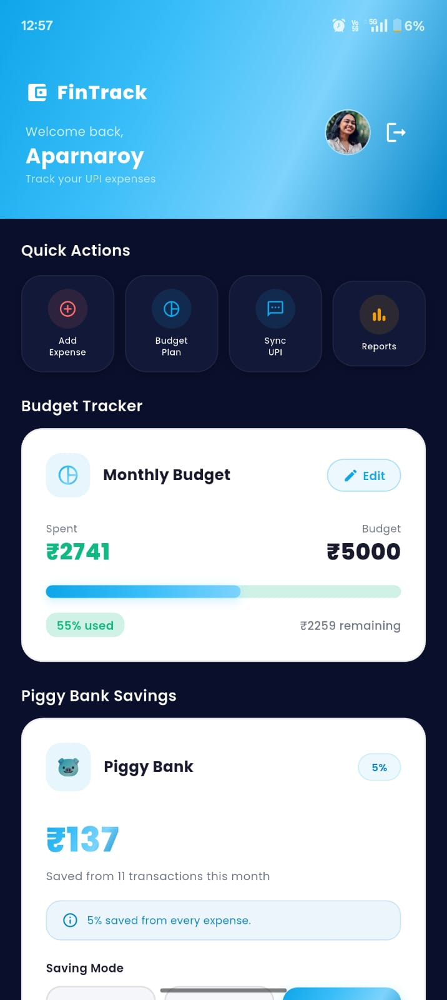
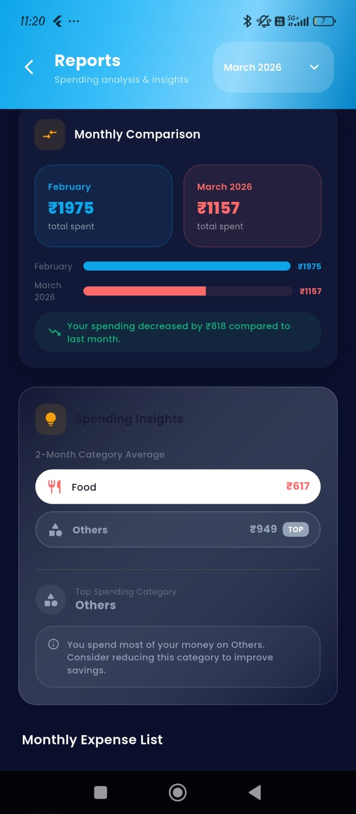

# 📱 FinTrack – Student Money Manager


A Flutter-based mobile application that automatically tracks UPI expenses from SMS notifications, helping students manage budgets, monitor spending, and achieve savings goals.

---

## ✨ Features

- 📩 Automatic UPI SMS expense detection
- 💰 Monthly budget management
- 🎯 Savings goal tracking
- 🐷 Virtual Piggy Bank
- 📊 Expense analytics dashboard
- 🔔 Budget alert notifications
- ☁ Firebase Authentication
- 💾 SQLite local database
- 🔄 Cloud backup with Firestore

---

## 🛠 Tech Stack

- Flutter
- Dart
- Firebase Authentication
- Cloud Firestore
- SQLite
- Flutter Local Notifications
- WorkManager

---

## 📸 Screenshots

## 📸 App Screenshots

### Login


### Dashboard


### Budget Setup


### Add Expense


### Savings Mode


### Reports


### Monthly Report


### Create Account


### Profile


## 🏗 Architecture

```text
Flutter UI
      │
      ▼
Business Logic
      │
 ┌────┴────┐
 ▼         ▼
SQLite   Firebase
      │
      ▼
Notification Service
```

---

## 📂 Folder Structure

```text
lib/
 ├── models/
 ├── screens/
 ├── services/
 ├── widgets/
 └── main.dart
```

---

## 🚀 Installation

```bash
git clone https://github.com/bhavya-39/FinTrack-Student-Money-Manager.git

cd FinTrack-Student-Money-Manager

flutter pub get

flutter run
```

---

## 🔮 Future Enhancements

- AI-powered expense categorization
- Receipt OCR scanning
- Spending prediction using Machine Learning
- Bank statement import
- PDF report generation

---

## 👨‍💻 Developer

**Bhavya B Nayar**
**Aparna Roy**
**Avani Krishna Ambadi A**

B.Tech Information Technology Student

---

If you found this project helpful, consider giving it a ⭐ on GitHub.
